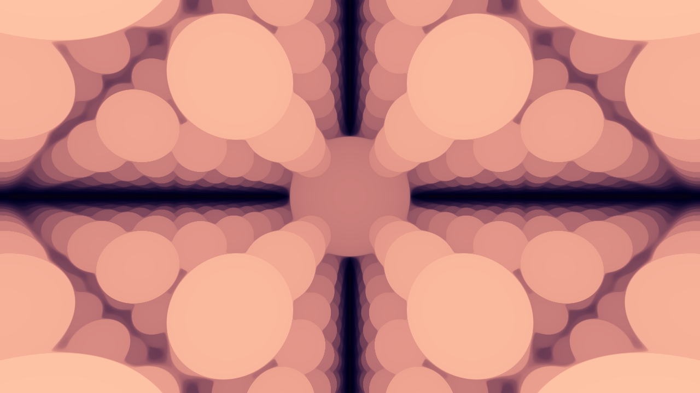
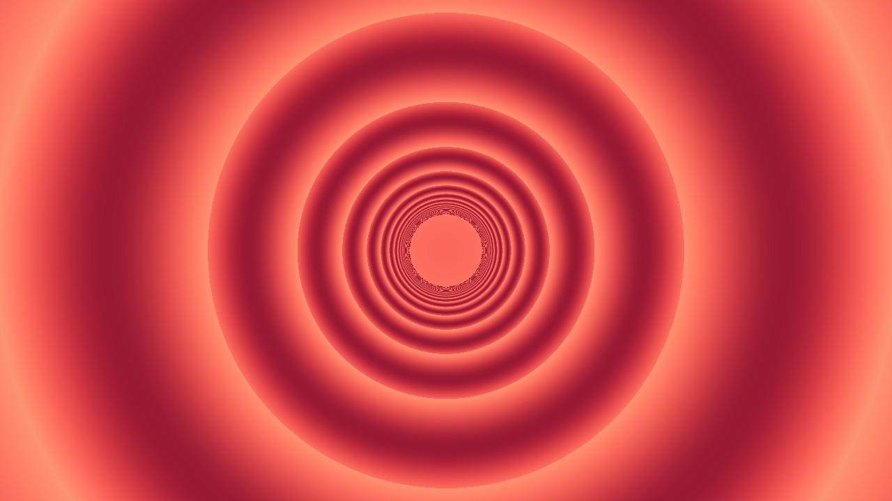
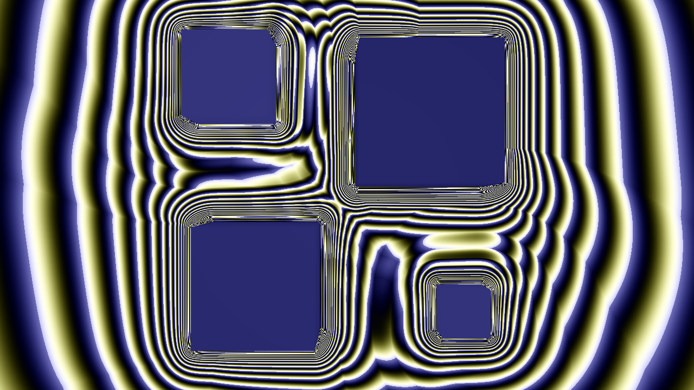
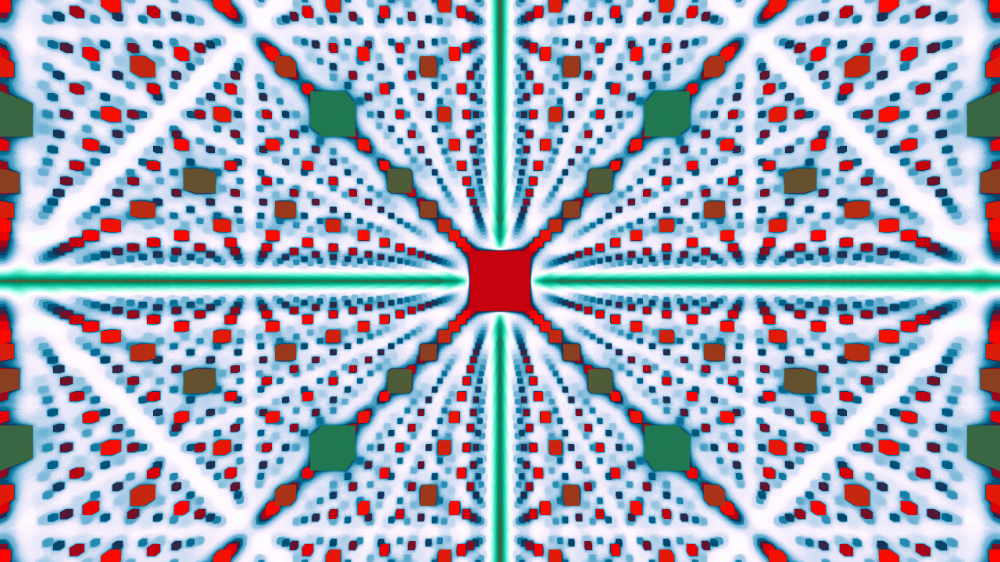

<div align=center>
<pre>
    __________  ___   _______________    __    _________   __________ 
   / ____/ __ \/   | / ____/_  __/   |  / /   /  _/__  /  / ____/ __ \
  / /_  / /_/ / /| |/ /     / / / /| | / /    / /   / /  / __/ / /_/ /
 / __/ / _, _/ ___ / /___  / / / ___ |/ /____/ /   / /__/ /___/ _, _/ 
/_/   /_/ |_/_/  |_\____/ /_/ /_/  |_/_____/___/  /____/_____/_/ |_|  
--------------------------------------------------------------------------
Coming Soon...
</pre>

[](https://opensource.org/licenses/MIT)
</div>

## Overview ##
A WIP Ray Marcher to create cool and interesting fractals! Created utilizing C++, CUDA, and the GLM Library. You can view my work on the basic version of this tool, which relies purely on the CPU, in the `main` branch. Meanwhile, you can view the GPU-accelerated version in the `cuda` branch.

## Render Examples ##








## Setup (main) ##
Clone this repository utilizing `git clone -b main https://github.com/ishanc312/Fractalizer.git`. In `main.cpp`, add objects here:
```cpp
std::vector<std::shared_ptr<Hittable>> scene = {
    // std::make_shared<ObjType>()
    // Objects go here. Refer to hittable.h for object names and constructors. 
};
```
Create a Palette utilizing four vectors:
```cpp
Palette testPalette(vec3(0.5f, 0.5f, 0.5f), vec3(0.5f, 0.5f, 0.5f), vec3(1.0f, 0.7f, 0.4f), vec3(0.0f, 0.15f, 0.20f));
```
Finally, create an instance of the `Camera` object, passing its position, focal length, a color Palette, a scene to render, and a boolean indicating if you want to use anti-aliasing. For example,
```cpp
Camera cam(vec3(0, 0, -4), 1.0, testPalette, 0.03, false);
```
Finally, write the following to render the scene:
```cpp
cam.renderImage(scene);
cam.outputImage();
```

To execute, run the following in your terminal (at the root directory of the cloned repository on your machine):
```
cmake -B build -S
cmake --build build
./build/Fractalizer > renders/output.ppm
```
This will create an image called `output.ppm` in the renders folder. 

